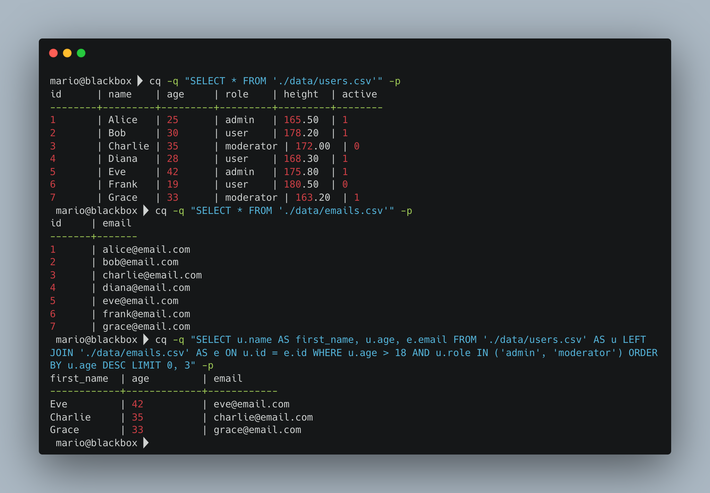

# cq - High-Performance SQL Query Engine for CSV Files

 

A lightweight, fast SQL query processor written in C that enables executing SQL queries directly on CSV files without requiring a database. For full documentation, see the /doc directory.

 

## Documentation

- Getting Started: `doc/GettingStarted.md`
- Installation: `doc/Installation.md`
- Command Line Interface: `doc/CLI.md`
- Architecture: `doc/Architecture.md`
- Testing: `doc/Testing.md`
- Roadmap: `doc/Roadmap.md`
- Contributing: `doc/Contributing.md`

## Quick Start

Build: `make`

Run a sample query:
`./build/cq -q "SELECT name, age FROM 'data.csv' WHERE age > 25" -p`

## Example SQL Files

The repository includes example SQL under assets/ (example_between.sql, example_aggregation.sql, etc.). See assets/ for details.

## Data & Features Overview

- See the /doc folder for detailed sections on data types, date formats, CSV format, and more.

## License

MIT License. See LICENSE file for details.
