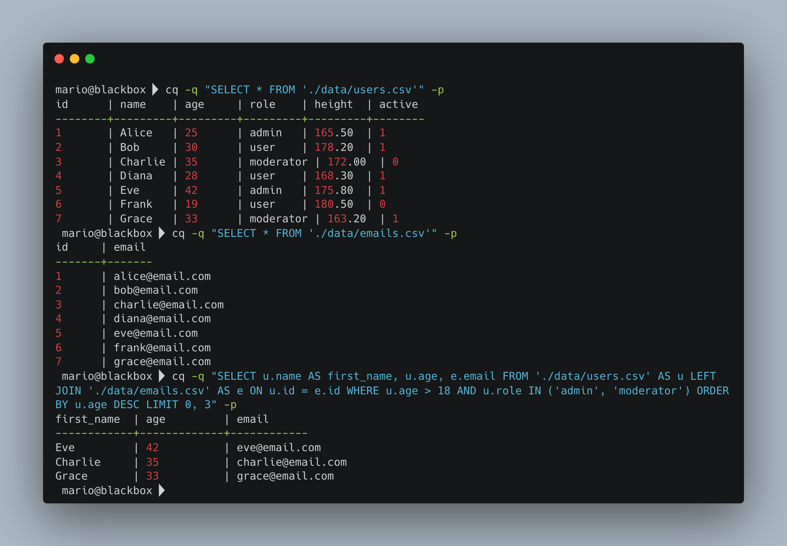

  

    
🌐 Language

    

      

        <a href="https://openaitx.github.io/view.html?user=baldimario&project=cq&lang=en">English</a>
        | <a href="https://openaitx.github.io/view.html?user=baldimario&project=cq&lang=zh-CN">简体中文</a>
        | <a href="https://openaitx.github.io/view.html?user=baldimario&project=cq&lang=zh-TW">繁體中文</a>
        | <a href="https://openaitx.github.io/view.html?user=baldimario&project=cq&lang=ja">日本語</a>
        | <a href="https://openaitx.github.io/view.html?user=baldimario&project=cq&lang=ko">한국어</a>
        | <a href="https://openaitx.github.io/view.html?user=baldimario&project=cq&lang=hi">हिन्दी</a>
        | <a href="https://openaitx.github.io/view.html?user=baldimario&project=cq&lang=th">ไทย</a>
        | <a href="https://openaitx.github.io/view.html?user=baldimario&project=cq&lang=fr">Français</a>
        | <a href="https://openaitx.github.io/view.html?user=baldimario&project=cq&lang=de">Deutsch</a>
        | <a href="https://openaitx.github.io/view.html?user=baldimario&project=cq&lang=es">Español</a>
        | <a href="https://openaitx.github.io/view.html?user=baldimario&project=cq&lang=it">Italiano</a>
        | <a href="https://openaitx.github.io/view.html?user=baldimario&project=cq&lang=ru">Русский</a>
        | <a href="https://openaitx.github.io/view.html?user=baldimario&project=cq&lang=pt">Português</a>
        | <a href="https://openaitx.github.io/view.html?user=baldimario&project=cq&lang=nl">Nederlands</a>
        | <a href="https://openaitx.github.io/view.html?user=baldimario&project=cq&lang=pl">Polski</a>
        | <a href="https://openaitx.github.io/view.html?user=baldimario&project=cq&lang=ar">العربية</a>
        | <a href="https://openaitx.github.io/view.html?user=baldimario&project=cq&lang=fa">فارسی</a>
        | <a href="https://openaitx.github.io/view.html?user=baldimario&project=cq&lang=tr">Türkçe</a>
        | <a href="https://openaitx.github.io/view.html?user=baldimario&project=cq&lang=vi">Tiếng Việt</a>
        | <a href="https://openaitx.github.io/view.html?user=baldimario&project=cq&lang=id">Bahasa Indonesia</a>
        | <a href="https://openaitx.github.io/view.html?user=baldimario&project=cq&lang=as">অসমীয়া</
      

    

  

# cq - High-Performance SQL Query Engine for CSV Files

 

A lightweight, fast SQL query processor written in C that enables executing SQL queries directly on CSV files without requiring a database. For full documentation, see the /doc directory.

 

## Documentation

- Getting Started: `doc/GettingStarted.md`
- Installation: `doc/Installation.md`
- Command Line Interface: `doc/CLI.md`
- **TUI (Terminal User Interface)**: `doc/TUI.md`
- Architecture: `doc/Architecture.md`
- Testing: `doc/Testing.md`
- Roadmap: `doc/Roadmap.md`
- Contributing: `doc/Contributing.md`

## Quick Start

Build: `make`

### Command Line

Run a sample query:
`./build/cq -q "SELECT name, age FROM 'data.csv' WHERE age > 25" -p`

### Terminal UI

Launch interactive TUI:
`./build/cqtui data/`

Features:
- Browse and open CSV files as tables
- Execute SQL queries interactively
- Multi-tab interface for multiple tables
- Keyboard-driven navigation
- No external dependencies

## Example SQL Files

The repository includes example SQL under assets/ (example_between.sql, example_aggregation.sql, etc.). See assets/ for details.

## Data & Features Overview

- See the /doc folder for detailed sections on data types, date formats, CSV format, and more.

## License

MIT License. See LICENSE file for details.
